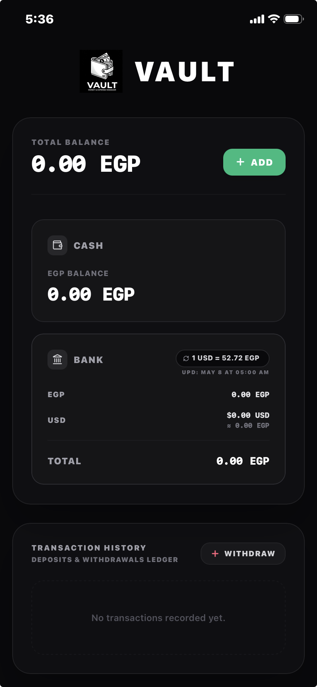

# Vault 🏦

Hey! Just so you know, this app was coded **fully by AI in like 1 hour** to help track money. 

It is super simple and highly customized to my personal use case only. But hey, if you have the same use case and want to use it too, feel free to run with it!

---

## 🔒 Your Data is Safe (Literally, It Never Leaves Your Phone)
* **Zero Servers**: No databases, no tracking, and no remote logins.
* **100% Local**: All your balances and transaction logs are stored directly inside your browser's **Local Storage**. 
* **Privacy First**: Since everything stays on your device, if you clear your browser's history/cookies, your data will go away. So don't do that unless you want a fresh start!
* Also Storing data in the browser to avoid the headache of deploying and configuring actual backend databases 😅.

---

## 📱 How to install this on your phone (iOS & Android)

You can turn this website into a real mobile app on your home screen so it opens in full-screen with no browser address bar!

### 🍏 For iPhone (iOS - Safari)
1. Open the [website](https://omarzydan.github.io/VAULT/) in **Safari**.
2. Tap the **Share** button (the square icon with an arrow pointing up at the bottom).
3. Scroll down and tap **Add to Home Screen**.
4. Tap **Add** in the top right corner. 
5. Boom! The **Vault** logo is now on your home screen.

### 🤖 For Android (Chrome)
1. Open the [website](https://omarzydan.github.io/VAULT/) in **Chrome**.
2. Tap the **three vertical dots** (menu) in the top-right corner.
3. Tap **Add to Home screen** (or **Install app**).
4. Follow the prompt to confirm.
5. Done! Open it like any regular app.

---

## 🌐 Credits & Acknowledgements
* **Exchange Rates**: Live currency exchange rates are powered by the free [FreeExchangeRateAPI](https://github.com/haxqer/FreeExchangeRateApi) developed by [@haxqer](https://github.com/haxqer).

